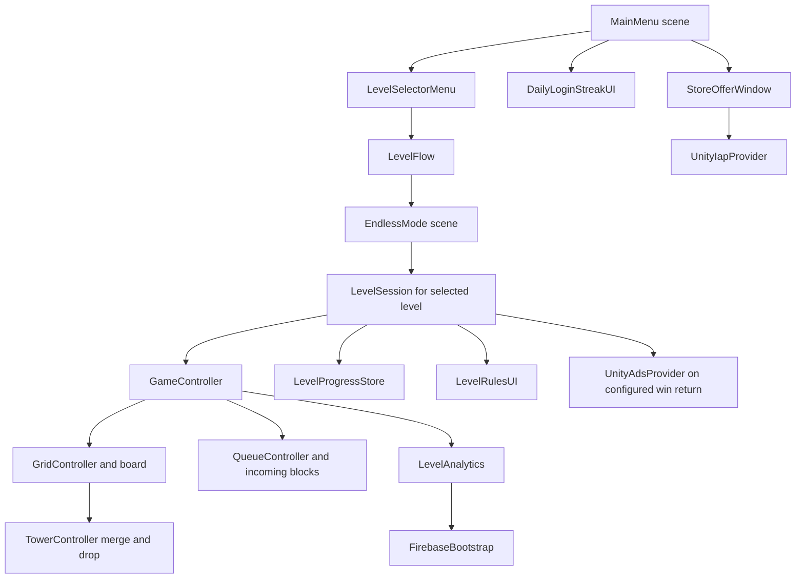

# City Blocks — Client Handoff Guide

This guide explains how the project is organized, how its gameplay systems fit together, how to safely edit level content in the Unity Editor, and what still needs account or store setup before release. It is written for a project owner who may prefer Inspector and prefab work over C# programming.

## 1. Project at a glance

- **Unity Editor:** `6000.4.5f1` (see `ProjectSettings/ProjectVersion.txt`).
- **Build scenes:** `Assets/Scenes/MainMenu.unity` and `Assets/Scenes/EndlessMode.unity` (both are enabled in `ProjectSettings/EditorBuildSettings.asset`).
- **Level content:** 100 `LevelDefinition` assets in `Assets/Resources/Levels/`.
- **Level scenes:** authored levels all use the shared `EndlessMode` scene. There is not a separate Unity scene for each level.
- **Visible UI:** created in Unity scenes and prefabs. Scripts connect buttons and text to gameplay; they do not construct the game's UI at runtime.
- **Platform services:** Firebase Analytics and Crashlytics files are included; Unity IAP and Unity Ads packages are requested in `Packages/manifest.json`. Store and ad identifiers are still blank.
- **Current test state:** level asset values and file references have received static checks. Play mode, device builds, live purchases, and live ads still need testing in the Unity Editor and on devices.

### Start here in Unity

1. Open the project using Unity `6000.4.5f1` from Unity Hub.
2. Wait for package import and Firebase's External Dependency Manager to finish. Check the **Console** window for red errors.
3. Open `Assets/Scenes/MainMenu.unity` and press **Play**.
4. To try a specific level, select its asset under `Assets/Resources/Levels/`, or use the level selector from the main menu.
5. To change visible layout or wording, open the relevant prefab under `Assets/Prefabs/UI/`; edit the prefab in the Inspector or Prefab Mode. Do not edit the runtime presenter scripts to reposition UI.

The two scenes listed above are the scenes currently included in the build. Do not remove `EndlessMode`: both the Endless mode and every authored level load it.

## 2. How the project is put together

### Scene and gameplay flow

### Important folders

| Folder | What belongs there | Typical reason to open it |
| --- | --- | --- |
| `Assets/Scenes/` | The main menu and gameplay scenes | Change scene-level objects or inspector references |
| `Assets/Resources/Levels/` | The 100 level definition assets | Add or tune a level without writing C# |
| `Assets/Resources/1.prefab` to `30.prefab` | Tower appearance prefabs, named by tower level | Change a tower's appearance or add another numbered tower visual |
| `Assets/Resources/StoreOffers/` | IAP offer configuration assets | Enter store IDs, names, included booster uses, and prices |
| `Assets/Resources/UnityAdsSettings.asset` | Unity Ads settings | Enter platform Game IDs and interstitial Ad Unit IDs |
| `Assets/Prefabs/UI/` | Prefab-authored UI | Change layout, text objects, button styles, and panel structure |
| `Assets/Prefabs/Obstacles/` | Breakable and unbreakable obstacle prefabs | Change obstacle art or visual durability pips |
| `Assets/Scripts/Gameplay/` | Game rules, level progression, save services, and SDK integrations | Extend or debug gameplay logic |
| `Assets/Scripts/UI/` | Button and panel presenters | Connect authored UI to gameplay systems |
| `Assets/Scripts/Data Persistence/` | Original Endless-mode saving code | Change the legacy Endless save format |
| `Assets/Firebase/` | Firebase Unity SDK files and native dependency declarations | Firebase package maintenance |
| `Assets/ExternalDependencyManager/` | Android/iOS dependency resolver used by Firebase | Resolve platform-native SDK dependencies |
| `Packages/manifest.json` | Unity package versions | Review or change Unity package dependencies |
| `ProjectSettings/` | Unity project, player, and build settings | Change bundle/package IDs or build scenes |

### C# namespaces

Most game-rule classes in `Assets/Scripts/Gameplay/` use the `Gameplay` namespace. UI presenters generally use `UI`; old save classes use `Data_Persistence`. A script that refers to one of these classes may need a matching `using Gameplay;`, `using UI;`, or `using Data_Persistence;` at the top. Unity also links scripts to scene and prefab components by their `.meta` GUID; keep `.meta` files when moving scripts.

## 3. Main classes and what they do

### Gameplay and levels

| Class | Plain-language responsibility |
| --- | --- |
| `Gameplay.LevelDefinition` | The editable recipe for one level: board size, blocks, queue, obstacles, moves, objectives, tutorial text, difficulty, and ad flag. It is a ScriptableObject, so it is edited as an asset in the Inspector. |
| `Gameplay.LevelCatalog` | Loads every `LevelDefinition` under `Resources/Levels`, checks validity and duplicate numbers, and sorts levels by number. Invalid assets are reported in the Console and skipped. |
| `Gameplay.LevelFlow` | Starts an unlocked level, loads `EndlessMode`, and attaches a `LevelSession` to that scene's `GameController`. With no selected level, the scene runs Endless mode. |
| `LevelSession` | Owns one authored level attempt: creates or resumes it, updates moves, checks all win conditions, saves it, and handles win/failure/retry/menu choices. |
| `Gameplay.GameController` | Coordinates input, queue use, turns, score, boosters, Endless mode, and the game state (`play`, `win`, `lose`, and related states). |
| `Gameplay.GridController` | Creates board cells, tracks occupied and blocked positions, places blocks, saves board positions, moves falling obstacles, and applies gravity. |
| `Gameplay.QueueController` | Holds the incoming towers and controls how many are visible. The normal preview is two towers. |
| `Gameplay.TowerController` | Animates a tower dropping, merges touching towers of the same level, updates its visual, and reports score-producing merges. |
| `Gameplay.BoardCameraFitter` | Adjusts the scene camera to frame the configured board size. |
| `Gameplay.BoardObstacle` | Stores obstacle type, position, and durability and updates its durability-pip visuals. |
| `Gameplay.FallingTowerController` | Animates a tower that has been consumed by a merge. |
| `Gameplay.LevelUpEffectController` | Controls the visual effect used when a tower levels up. |

### Progress, UI, and services

| Class | Plain-language responsibility |
| --- | --- |
| `Gameplay.LevelProgressData` | The serializable level save model: unlocked/completed levels, active run, attempts, booster inventory, receipts already processed, and ad-removal status. It also contains `PowerUpInventory` and `LevelRunData`. |
| `Gameplay.LevelProgressStore` | Reads and writes level-mode progress to `Application.persistentDataPath/level-progress.json`. |
| `Data_Persistence.DataPersistenceController` | Saves the original Endless-mode game state and records. It deliberately does not load that save when `EndlessMode` is currently being used for a selected level. |
| `Data_Persistence.FileHandler` | Reads and writes the original Endless-mode save files. The filenames are set on the `DataPersistenceController` object in the scene. |
| `UI.LevelSelectorMenu` | Displays up to 12 level buttons per page, shows locked/completed/current labels, and starts a selected unlocked level. It sends a new player to level 1 for the first tutorial. |
| `UI.LevelRulesUI` | Connects the level rules prefab's move counter, three-tower preview, tutorial, win/loss buttons, and extra-moves purchase button to `LevelSession`. |
| `UI.PlayButton_MainMenu` | Opens Endless mode only after the configured unlock level has been completed. Its `endlessUnlockLevel` defaults to 3. |
| `UI.DailyLoginStreakUI` | Opens the daily reward panel, claims today's credit reward, and enables/disables reminder notifications. |
| `Gameplay.DailyLoginStreakService` | Calculates the seven-day streak and reward amount and stores its state locally. |
| `Gameplay.DailyLoginNotification` | Requests local-notification permission and schedules or cancels daily reminders on iOS and Android. |
| `UI.StoreOfferWindow` | Displays the prefab-authored Store panel and sends purchase requests for the daily special or no-ads offer. |
| `UI.StoreMenuButton` | Connects the existing main-menu Store button to `StoreOfferWindow`. |
| `Gameplay.PowerUpStore` | Tracks booster uses, handles confirmed purchase fulfillment, stores the no-ads entitlement, and provides purchase/ad request events to providers. |
| `Gameplay.StoreOfferDefinition` | A ScriptableObject describing one IAP item and the items, booster uses, or extra moves it grants. |
| `Gameplay.StoreProviderBridge` | Optional UnityEvent bridge for manually connecting another store/ad provider. The current Unity IAP provider already handles IAP requests. |
| `Gameplay.LevelAnalytics` | Names analytics events and their parameters and sends them to `FirebaseBootstrap`. |
| `Gameplay.FirebaseBootstrap` | Initializes Firebase dependencies before scenes load, queues events while Firebase starts, and enables Crashlytics fatal-exception reporting. |
| `Gameplay.UnityIapProvider` | Loads configured offers, connects to Apple/Google stores using Unity IAP, restores permanent purchases, and fulfills confirmed purchases. |
| `Gameplay.UnityAdsProvider` | Initializes the current Advertisement API integration, preloads interstitials, and shows one on a configured win-to-menu path when already ready. |
| `Gameplay.UnityAdsSettings` | ScriptableObject holding platform Game IDs, interstitial Ad Unit IDs, and test-mode setting. |

Other small UI scripts under `Assets/Scripts/UI/` handle the existing play, pause, back, row-delete, tower-delete, and level-up buttons. `UI.Cell` passes board-cell input to `GameController` through `GridController`.

## 4. Gameplay features and how to edit them

### Levels and progression

The level assets are automatically loaded from `Assets/Resources/Levels/`; they are not listed one by one in Build Settings. `LevelCatalog` checks each asset's `levelNumber` and `LevelDefinition.IsValid()` before it can appear in the level selector.

To add a level without programming:

1. In the Unity Project window, duplicate a level asset that is close to the design you want. Rename it to the next number, for example `Level101.asset`.
2. Select the new asset. In the Inspector, set **Level Number** to a unique number (`101` in this example).
3. Set the board, starting blocks, queue, obstacles, move limit, and objectives using the fields described below.
4. Save the asset and check the Unity Console for `Invalid level definition` messages.
5. Test it from the level selector after unlocking it, or temporarily test through a development-only unlocked save. Do not change another player's persistent save just to make a level selectable.

The project has 100 assets now. Levels 1–3 retain their onboarding setups. Levels 4–100 have a gradual authored challenge curve: the tower goal rises from level 5 to level 10; the score target has a five-point-per-level component and rises further when the tower goal advances; breakable obstacles are added and strengthened over time; later levels introduce falling and fixed unbreakable cells. Levels 4–50 are marked **Hard** and 51–100 **Very Hard**. These values have static validation but still need player playtesting and balance tuning.

All levels use the common `EndlessMode` scene. This allows the client to make most new level designs through the asset Inspector. If a level needs unique scene objects or a bespoke mechanic, it will need a separate scene and additional routing/build-settings work; that per-level-scene system is not present yet.

#### `LevelDefinition` fields

| Inspector field | Meaning and safe editing notes |
| --- | --- |
| `levelNumber` | Unique progression number. Use sequential numbering so Next Level and unlock progression behave predictably. |
| `difficulty` | `Normal`, `Hard`, or `VeryHard`. The selector can show the latter two labels. This is a label; it does not itself change game rules. |
| `columns`, `rows` | Board width and playable height, each from 3 to 7. The camera fitter uses these values. |
| `unavailableCells` | Holes in the board. Cell coordinates start at 0: column 0 is the leftmost column; row 0 is the bottom row. A block cannot land in a hole and will fall through it. |
| `startingBlocks` | Towers placed when a new run begins. Each entry has `column`, `row`, and `towerLevel`. A starting block cannot share a cell with a hole or obstacle. |
| `obstacles` | Occupied cells, with `type`, `column`, `row`, and `durability`. Breakable durability is 1–4. Fixed/falling unbreakable obstacles do not use durability. |
| `queue` | Optional ordered entries for the next towers. When these entries run out, new towers use `randomMaximumLevel`. |
| `randomMaximumLevel` | The fallback range is random from tower level 1 up to this value, inclusive. Must be at least 1. |
| `moveLimit` | `0` means unlimited moves. A positive number is the number of blocks the player may drop before a move-limit failure. |
| `objectives` | All objectives in the list must be met. Available objective types are `ReachTowerLevel` and `ReachScore`. |
| `tutorialSteps` | Text steps for the first-level tutorial. The current tutorial UI is intentionally shown only on level 1. |
| `showAdAfterWin` | If true, choosing Return to Menu after a win requests an interstitial. An unavailable ad is skipped so the menu can continue. |

**Queue examples in the Inspector:**

- **Fixed order:** add entries of type `Exact`; set `exactLevel` for each. For example, `Exact 1`, `Exact 1`, `Exact 2` gives three known blocks in that order.
- **Random level range:** add `RandomRange`; set `minimumLevel` and `maximumLevel`, inclusive. For example, minimum `2`, maximum `4` can produce tower levels 2, 3, or 4.
- **Random block:** add `RandomAny` to draw from 1 through `randomMaximumLevel`.
- If the queue list is empty, or the entries have been used, the controller also falls back to `randomMaximumLevel`.

Every starting block, obstacle, and hole must fit the grid and occupy a different cell. The project validates grid bounds, duplicate positions, obstacle types, queue ranges, positive objective targets, and the presence of at least one objective. It does not simulate a level to prove that its objectives are beatable.

**Example from the current project — Level 024:** 4 columns by 6 rows, a level-6 tower objective and a score objective of 300, four breakable obstacles, no move limit, and random queue fallback up to tower level 6. This is a content asset; the exact values can be inspected in `Assets/Resources/Levels/Level024.asset`.

### Grid, camera, queue, and block visuals

- `GridController.Configure()` reads the selected level's board size and holes, then creates a grid with an extra temporary row for incoming blocks.
- `BoardCameraFitter.Fit()` frames the board using the same configured dimensions.
- `QueueController.visibleCount` normally shows two towers. Level preview changes it to three for three moves.
- `TowerController` uses `Resources.Load<GameObject>(towerLevel.ToString())` to load the artwork for a tower. The included visuals are `Assets/Resources/1.prefab` through `30.prefab`. If adding a tower tier beyond 30, create a matching numbered resource prefab; otherwise the Console reports that the tower visual is missing.
- Level-specific queue entries and saved queue positions are handled by `GameController` and `LevelSession`.

### Obstacles and merging

`LevelDefinition.obstacles` uses the `Gameplay.BoardObstacleType` choices:

- **Breakable:** each merge of an adjacent tower damages it; it disappears when durability reaches zero. The obstacle prefabs show durability pips.
- **FixedUnbreakable:** stays in its cell and cannot be damaged.
- **FallingUnbreakable:** moves down when the space below becomes available; towers above it can then settle under gravity.

The existing obstacle prefabs are `BreakableCell.prefab`, `FixedUnbreakableCell.prefab`, and `FallingUnbreakableCell.prefab` under `Assets/Prefabs/Obstacles/`. The `GridController` in `EndlessMode` must keep references to all three prefabs. When adding a *new* obstacle type, code and prefab wiring are needed; adding one of the existing types is data-only.

Equal-level towers touching on the board merge. `TowerController` applies the merge, `GridController` resolves falling blocks/obstacles, and `GameController.IncrementScore()` adds `towerLevel * 10` for a tower-level-up event.

### Moves, goals, success, and failure

- `LevelSession.RecordMove()` reduces the move count when a block is dropped if `moveLimit` is positive.
- `LevelSession.ObjectivesMet()` requires every configured objective to be satisfied: tower level and/or score.
- After each move settles, `LevelSession.ResolveMove()` checks success first, then a move-limit or full-board failure, then saves progress.
- `LevelRulesUI` shows the win or loss prefab panels. **Next Level** loads the next available definition; **Retry** starts a new attempt; **Return to Menu** saves or finalizes the attempt as appropriate.
- A move-limit loss can offer the configured Extra Moves product. A board-full failure cannot continue through that offer.
- When a positive move limit has been reached, Extra Moves adds the amount in `ExtraMovesOffer.extraMovesOnPurchase` and resumes the same run. The starter offer is five moves. Its purchase button stays hidden until the offer has a product ID.

### First-time tutorial, level selector, and Endless mode

- `LevelSelectorMenu.Start()` detects a new save with no completed levels and immediately starts level 1. The level 1 tutorial steps live in the `Level001` asset.
- `LevelRulesUI` displays tutorial text and advances through the list. It records that the first-level tutorial was completed.
- The selector shows 12 levels per page and enables levels up to `highestUnlockedLevel`.
- Completing a level marks it complete and unlocks the next asset number found by `LevelCatalog.Next()`.
- `UI.PlayButton_MainMenu.endlessUnlockLevel` defaults to 3. Endless mode opens after that level has been completed.
- Both play modes run in `EndlessMode`. `LevelFlow.IsLevelMode` and the attached `LevelSession` distinguish an authored level from Endless play.

### Booster inventory and three-block preview

Booster use inventory is in `Gameplay.PowerUpInventory`; `PowerUpStore.TryUse()` checks and subtracts a use and saves the result. The current booster types are:

| Booster | What it does |
| --- | --- |
| `delete` | Remove one selected tower and settle the column. |
| `deleteRow` | Remove towers in the selected row and settle affected columns. |
| `levelUp` | Raise a selected tower by one, then process its merge. |
| `extraTurns` | In level mode, add three moves. |

The UI labels may use names such as “delete row” while the code enum is `deleteRow`. To change booster counts in a paid bundle, edit the offer asset's `includedUses` values. Uses are only granted after IAP confirms a purchase.

The level-mode preview is separate from the paid booster inventory. `GameController.ActivatePreview()` reveals three upcoming blocks for three placed moves, once per level run, and stores that state so resuming does not reset it. Its button and label are in the `LevelRulesUI` prefab.

### Daily login rewards and reminders

- `DailyLoginStreakService` stores the last claimed local date, streak day, and accumulated reward credits in `daily-login-streak.json` under `Application.persistentDataPath`.
- Rewards currently are 100, 150, 200, 250, 300, 400, and 500 credits for days 1–7. A missed calendar day resets the next claim to day 1; a second claim on the same local date is rejected.
- `DailyLoginStreakUI` is the presenter on the prefab-authored `DailyLoginRewards.prefab`. Edit the texts/layout there, not by creating controls in a script.
- `DailyLoginNotification` asks the operating system for permission. After permission, it schedules a local reminder at 10:00 local time and can cancel it when the user turns reminders off.
- The credits currently are only earned, saved, and displayed. They are **not** a spendable currency and are not connected to the Store or `priceInPowerUpUses`.

### Store and Unity IAP

The main-menu Store button opens `Assets/Prefabs/UI/StoreOffersWindow.prefab`. `StoreMenuButton` finds the scene's `StoreOfferWindow`; the presenter fills its text, toggles the panel, and requests purchases through `PowerUpStore`. The layout is prefab-authored and can be changed in Prefab Mode.

The following offer assets are already in `Assets/Resources/StoreOffers/`:

| Asset | Intended use | Product type/behavior |
| --- | --- | --- |
| `DailySpecialOffer.asset` | Main-menu daily-special offer | Consumable by default; set included booster uses and offer copy. |
| `NoAdsOffer.asset` | Main-menu Remove Ads offer | Non-consumable entitlement; restored on later store initialization. |
| `ExtraMovesOffer.asset` | Level loss offer | Consumable; currently configured for 5 extra moves. |

Product IDs in all three assets are intentionally blank. The Store buttons are disabled until IDs are configured. The Extra Moves button is hidden until its product ID is configured.

#### Configure IAP

1. Create matching consumable/non-consumable products in **App Store Connect** and **Google Play Console**. The product IDs must match the project offer configuration.
2. In Unity, select an offer asset under `Assets/Resources/StoreOffers/`.
3. Set `productId` to a shared canonical product ID. If Apple and Google need different store IDs, also set `appleProductId` and `googleProductId`; leave an override blank to use the shared ID for that store.
4. Set `displayName` and `description`. Set `includedUses` for booster bundles or `extraMovesOnPurchase` for extra moves. Mark permanent offers `noAdsOffer` or `nonConsumable`; booster/extra-move offers should be consumable.
5. Set `priceValue` and `currencyCode` as fallback analytics values. IAP localized store price is used when available.
6. Let Package Manager resolve `com.unity.purchasing` and test through Apple sandbox/TestFlight and Google Play internal testing with registered tester accounts.

`priceInPowerUpUses` is currently display metadata only. The store does not deduct daily credits or booster uses as payment. The current purchase system uses Apple/Google IAP products. Purchases are fulfilled on the client after the store confirms the order; this project does not have server-side receipt validation or a cloud entitlement service.

For example only (these are **not** real store IDs): a five-move consumable could use product ID `com.yourstudio.cityblocks.extra_moves_5` with `extraMovesOnPurchase = 5`; a permanent ad-removal item could use `com.yourstudio.cityblocks.no_ads` with `noAdsOffer = true` and `nonConsumable = true`. The IDs in the store dashboards and the IDs in the offer assets must match exactly. The no-ads entitlement is the only generic permanent entitlement currently restored in code; a new permanent item needs its own restoration/fulfillment handling.

`UnityIapProvider` loads offers using `Resources.LoadAll<StoreOfferDefinition>("StoreOffers")`. Keep offer assets in that folder. It skips blank IDs and warns in the Console. It records the transaction ID before granting content so a redelivered order will not grant twice. The no-ads entitlement is saved locally and restored from confirmed non-consumable purchases.

### Ads

`UnityAdsProvider` reads `Assets/Resources/UnityAdsSettings.asset`, initializes the Advertisement SDK if platform fields are filled, and preloads an interstitial. A level only requests an interstitial after a win when the player chooses Return to Menu and `showAdAfterWin` is true. The provider shows an ad only if one is already loaded; a blank configuration or unavailable ad is skipped so the user can continue. `PowerUpStore.AdsRemoved` suppresses that request after the no-ads entitlement is saved.

#### Configure and test ads

1. Create/configure the game and interstitial ad units in Unity's monetization dashboard.
2. Fill `androidGameId`, `iOSGameId`, `androidInterstitialAdUnitId`, and `iOSInterstitialAdUnitId` in `Assets/Resources/UnityAdsSettings.asset`.
3. Keep `testMode` enabled while testing.
4. Configure and implement consent before SDK initialization for regions where it is required. Consent setup is not included in `UnityAdsProvider` yet.
5. Test on supported mobile builds. Ads will not be served with blank identifiers.

**Version/support caveat:** the project requests `com.unity.ads` **4.19.0** while the Editor is `6000.4.5f1`. Unity's package listing describes 4.19.0 as released for Editor 6000.5, so confirm package/editor compatibility before building. Unity's current Advertisement Legacy guidance recommends LevelPlay for monetization; other Unity integration guidance says existing direct integrations may still receive ad fill but can see reduced performance. Review [Unity's Advertisement Legacy package guidance](https://docs.unity.com/en-us/engine/6000.5/manual/packages-list/packages-all/pack-safe/com-unity-ads) and [Unity's migration guide](https://docs.unity.com/en-us/grow/levelplay/sdk/unity/migrate-from-unity-ads-to-levelplay) before launch. The existing provider is a starter integration and may need to be migrated.

### Analytics, Firebase Analytics, and Crashlytics

`Gameplay.LevelAnalytics` is the project event facade. Gameplay and store scripts call it instead of embedding Firebase event code throughout the game. `FirebaseBootstrap` checks SDK dependencies on startup and queues events until Firebase becomes available. `Assets/Firebase/` contains Firebase Unity SDK files at version 13.17.0 and native dependency XML; `Assets/ExternalDependencyManager/` resolves native Android/iOS dependencies. Crashlytics uncaught exceptions are configured to report as fatal.

Current setup:

- Firebase project ID in `Assets/GoogleService-Info.plist`: `cityblocks-f9373`.
- The iOS bundle ID in the plist matches the current iOS Player identifier: `com.Unity-Technologies.com.unity.template.CityBlocks`.
- No `google-services.json` is present for Android.
- Android Player identifier is still Unity's template value: `com.UnityTechnologies.com.unity.template.urpblank`. Replace it with the client's final, stable package name and register that exact ID in Firebase and Google Play.

#### Events and parameters

The event facade currently has these names and parameters:

| Event | Parameters |
| --- | --- |
| `level_start` | `level_number`, `attempt_number` |
| `level_complete` | `level_number`, `attempt_number`, `moves_remaining` |
| `level_fail` | `level_number`, `attempt_number`, `failed_objective` |
| `level_quit` | `level_number`, `attempt_number` |
| `endless_level_start` | `attempt_number` |
| `endless_level_fail` | `level_reached`, `attempt_number`, `total_moves` |
| `endless_level_quit` | `level_reached`, `attempt_number`, `total_moves` |
| `booster_used` | `booster_id`, `level_number`, `attempt_number`, `is_endless_level` |
| `store_open` | `entry_point`, `level_name` |
| `view_item_list` | `item_category` |
| `view_item` | `item_id`, `item_category` |
| `begin_checkout` | `item_id`, `value`, `currency` |
| `purchase` | `transaction_id`, `value`, `currency`, `items`, `is_first_purchase`, `levels_completed` |
| `purchase_failed` | `item_id` |
| `ad_impression` | `ad_platform`, `ad_format`, `level_number`, `is_endless_level` |
| `ad_load_failed` | `ad_format`, `error_code` |

`insufficient_funds(currency, shortfall, item_name, level_name)` exists in `LevelAnalytics` but has no caller because no currency-spending flow exists. `daily_reward_claimed(streak_day)` is an additional event emitted by the login reward code. Event callbacks also raise `LevelAnalytics.EventRecorded`, which can be observed by editor-side diagnostic code.

To finish Firebase setup, replace or add configuration files that match the final platform IDs, set the final Android package identifier in **Project Settings > Player > Android > Other Settings > Identification**, and let the dependency manager resolve native SDKs. Test Analytics in Firebase DebugView and Crashlytics using Firebase's current test procedure on a development device build. Editor success alone does not prove native SDK setup is correct.

### Local save files

There are two separate save systems:

1. **Authored-level progress:** `Gameplay.LevelProgressStore` writes `level-progress.json` in `Application.persistentDataPath`. It includes unlocks, completions, attempt counters, the active run/board/queue, preview state, booster uses, purchase transaction IDs, and the no-ads flag. Saving uses a temporary file before replacing the main file.
2. **Endless-mode progress:** `DataPersistenceController` and `FileHandler` preserve the old Endless board and records in the files named `SaveGameData` and `ProgressionData` (configured on the Endless scene's persistence object; no file extensions are appended by the current writer).
3. **Daily login state:** `DailyLoginStreakService` uses `daily-login-streak.json` in the same persistent data folder.

These files live in the app's writable data area, not beside the Unity project. For a clean first-run test, use a fresh device/app data sandbox or explicitly clear that app's data. Do not change a live player's save file as a normal content-editing step.

## 5. AI tooling currently in the project

The Unity package manifest requests:

- `com.unity.ai.assistant` **2.20.0-pre.1** — Unity Editor AI Assistant package (preview version).
- `com.unity.ai.inference` **2.6.1** — Unity Inference Engine runtime for local model inference.

These are tools/runtimes, not a gameplay feature. The game does not currently load a model, ship model weights, call an AI service during play, or depend on inference to run. There is no project-specific prompt library, AI agent configuration, or gameplay model setup checked into the project. A developer can use Unity's Editor Assistant if their Unity Editor/account setup supports it, and can build a local inference feature later, but the model and application logic would still need to be added and tested. The `.pre` Assistant version may change during package resolution; review it before a production handoff.

## 6. Known gaps and handoff tasks

These are not editor-only content edits; the client needs to decide/configure/complete them:

- **Progression economy:** daily credits are not spendable; the store's `priceInPowerUpUses` field does not debit anything; `insufficient_funds` is not emitted.
- **Daily special purchase design:** the current Store panel has a Daily Special IAP offer. It is not a purchase window that spends daily reward credits.
- **Loss purchase behavior:** extra moves are offered only for a configured move-limit failure, not a board-full loss.
- **Online purchase security:** no server receipt validation, server-managed entitlements, or cross-device purchase-save service exists.
- **Android Firebase:** change the Android package ID and add the matching `google-services.json`.
- **Production IDs and review:** create the store products, fill IAP IDs, fill Unity Ads IDs or migrate to a supported ad path, set final app identifiers, configure ad consent/privacy, and test with store sandbox accounts.
- **Content balance:** the ramp is authored and structurally validated, but not playtested. Adjust levels after observing players and confirming all objectives are practical.
- **Automated/runtime validation:** the project has an obstacle smoke check at **Tools > City Blocks > Verify Obstacles**. Run it in the Unity Editor after package import. It covers the level 3 obstacle examples and save round trip, not every level or full gameplay. The client should also play both modes, inspect the Console, and test native Android/iOS builds. Live IAP, notifications, Firebase, and ads need device-level verification.

## 7. Package and app setup reference

`Packages/manifest.json` currently requests the following relevant packages:

| Package | Requested version | Purpose |
| --- | --- | --- |
| `com.unity.purchasing` | `5.4.3` | Apple/Google store purchases |
| `com.unity.ads` | `4.19.0` | Current starter Advertisement API integration; see support caveat above |
| `com.unity.mobile.notifications` | `2.4.2` | Local daily reminders |
| `com.unity.ai.assistant` | `2.20.0-pre.1` | Unity Editor AI Assistant (preview) |
| `com.unity.ai.inference` | `2.6.1` | Local model inference runtime |
| `com.unity.render-pipelines.universal` | `17.4.0` | URP render pipeline |

The complete package manifest also lists Unity's normal editor and built-in packages; this table shows the main packages a client may need to review. Allow Package Manager to resolve changes and check `Packages/packages-lock.json` after opening the project.

## 8. Where to make common changes

| Desired change | Open this asset or script |
| --- | --- |
| Change a level goal or obstacle | `Assets/Resources/Levels/LevelNNN.asset` in Inspector |
| Add an ordered queue | A level asset's **Queue** list in Inspector |
| Change how the selector looks | `Assets/Prefabs/UI/LevelSelectorPanel.prefab` and `LevelTileButton.prefab` |
| Change win/loss/preview/tutorial UI | `Assets/Prefabs/UI/LevelRulesUI.prefab`; behavior is connected by `UI.LevelRulesUI` |
| Change the main-menu Store UI | `Assets/Prefabs/UI/StoreOffersWindow.prefab`; offer data is in `Assets/Resources/StoreOffers/` |
| Change daily reward UI | `Assets/Prefabs/UI/DailyLoginRewards.prefab` |
| Change obstacle art/pips | One of the prefabs in `Assets/Prefabs/Obstacles/` |
| Change booster behavior | `Gameplay.GameController`, `Gameplay.PowerUpStore`, and `Gameplay.PowerUpInventory` |
| Change win/objective logic | `Gameplay.LevelSession.ObjectivesMet()` and `Gameplay.LevelDefinition` |
| Add a new objective type | C# change: `LevelObjectiveType`, then objective evaluation and failed-objective reporting in `LevelSession` |
| Change analytic names/parameters | `Gameplay.LevelAnalytics`; then check the call site and Firebase dashboard reports |
| Configure store IDs/contents | `Assets/Resources/StoreOffers/*.asset` plus matching Apple/Google products |
| Configure ads | `Assets/Resources/UnityAdsSettings.asset` and the selected ad provider/dashboard |
| Change platform bundle IDs | Unity **Project Settings > Player > Identification** for each platform |

Before changing C# logic, duplicate the project or create a source-control branch, change one system at a time, and check the Unity Console before making a device build.

## 9. External setup links

- [Unity IAP setup](https://docs.unity.com/en-us/iap/set-up)
- [Unity Advertisement Legacy package status](https://docs.unity.com/en-us/engine/6000.5/manual/packages-list/packages-all/pack-safe/com-unity-ads)
- [Unity Ads to LevelPlay migration](https://docs.unity.com/en-us/grow/levelplay/sdk/unity/migrate-from-unity-ads-to-levelplay)
